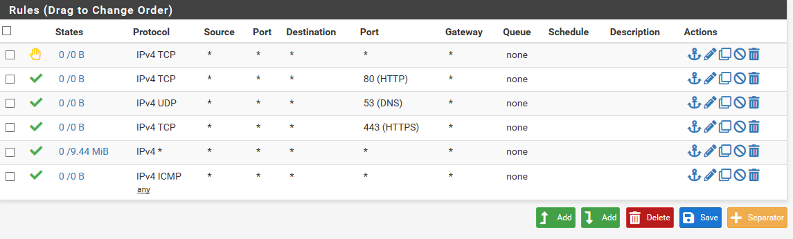
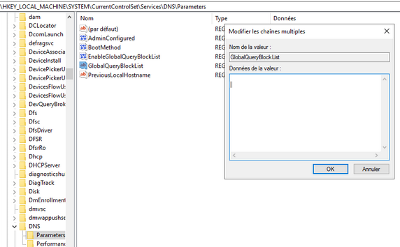
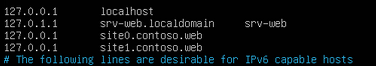

DOSSIER TECHNIQUE

Durée :

    32h

Introduction :

    Sécurité des systèmes d’informations (Linux/Windows)
    Établir les bases nécessaires à la compréhension de la problématique (concepts, terminologie, classification)
    Dresser un panorama global des risques et des solutions
    Illustrer ces concepts et solutions par des réalisations pratiques
    Les positionner dans le contexte du monde actuel via des études de cas
    Comprendre ce qu'est la PRA (Plan de Reprise d'Activité) et la redondance pour la continuité des services

Solutions à mettre en œuvre :

    Le firewall devra remplir les rôles de : Gestion des flux, Proxy, Reverse Proxy, Détection d'intrusion
    Le contrôleur de domaine devra permettre la gestion du DNS local et des GPO qui seront appliquées au poste client
    La gestion des flux entrants et sortants devra être gérée par le firewall, seuls les ports 80 et 443 seront autorisés
    Le Proxy lié au service SquidGuard, devra permettre la gestion du blocage de noms de domaines / url etc en sortie
    Le Reverse Proxy devra permettre l'accès au travers d'un nom de domaine unique et de ses 2 sous-domaines à 2 Virtual Host (ports 80 et 81) hébergés sur le serveur Web, le tout devra être chiffré sur le protocole https côté WAN du firewall
    La configuration du Proxy sera poussée sur les navigateurs Edge et Firefox des postes clients par GPO

Mise en place d\'une infrastructure comprenant :

-   1 firewall

-   1 serveur Web

-   1 contrôleur de domaine

-   1 client

Année 2020 - 2021

L'objectif de ce dossier technique est de mettre en place une
architecture similaire à celle-là :

Installation + configuration de l'ISO pfSense

Create a new VM → Custom → workstation 16.x

I will install the operatin system later pour empecher la creation de
fichiers de reponses automatiques

FreeBSD 12-64 bits → version

Nb process → 1

Nb core → 2 / 4

Memory of this virtual machine → 512 MB

Network type → NAT

Disk → 40G → store virtual disk as a single file

On ajoute 2 nouvelles cartes réseaux secu-DMZ / secu-LAN

On fait une snapshot

On ajoute l'iso pfsense au CV/DVD puis on exec

On accepte, choix langue, choix BIOS puis on installe

On config l'IP du WAN sur 192.168.5.54 sur la passerelle 192.168

On configure la 3^e^ carte réseau non reconnu (em2) en tant que LAN

On définit le LAN sur l'adresse 192.168.15.54

On démarre une VM Client que l'on met sur le segment secu-LAN

On modifie l'adresse IP :

Voulez-vous autoriser les autres pc de ce réseau a détecter votre pc →
oui

Pour accéder à l'interface Web de pfSense on se rend dans son navigateur
à l'adresse 192.168.1.54

Les identifiants par défaut de pfSense : id : admin / mdp : pfsense

On va dans firewall → Rules → OPT1(em2)

On active l'interface (enable)

On se retrouve avec nos 3 cartes

Voici la configuration rules de LAN pour l'instant

On désactive les règles par défaut sur l'interface LAN

Cependant on laisse activer la Rule Anti-lockout Rule car elle autorise
l'adresse ip du firewall l'accès au port 443 et 80. Elle autorise
n'importe quel client sur l'interface LAN a accéder à l'interface web à
partir des ports 443 et 80.

On crée plusieurs règles qui permettront la sortie de la zone LAN vers :
la résolution DNS, le PING, http, https vers \"tout\"

Les règles sont lues de haut en bas, on applique donc la règle DNS en
haut de la liste

On ajoute donc 4 Rules en cliquant sur le bouton « add »

-   Le protocole ICMP (test : ping 8.8.8.8 en cmd)

-   Le port 53 pour la résolution de noms (DNS)

-   Le port 80 et 443 (http/https)

Règle qui permet la sortie LAN vers la résolution DNS :

Règle qui permet la sortie LAN vers le PING

Règle qui permet la sortie LAN vers le HTTP & l'HTTPS

On télécharge une iso Ubuntu mini

On la connecte au segment LAN-DMZ qui correspond à notre réseau pour le
serveur web

On configure le fichier 01.netcfg.yaml dans etc/netplan en désactivant
le DHCP (pas de DHCP pour les serveurs). On lui attribue une adresse IP,
une gateway et un DNS

Pour autoriser l'accès au port 81 du serveur Web, on doit spécifier en
plus l'écoute au port 81 directement dans le fichier port.conf d'Apache

On applique les changements avec systemctl restart apache2

Pour pouvoir accéder à Internet, il faudra dans pfSense ajouter une
nouvelle règle :

Firewall → Rules → OPT1 : protocol : any ; from any to any

Dans le serveur web on applique les changements : sudo netplan apply

On met tout à jour avec apt-get update

Nous allons désormais installer Apache2 pour mettre en place notre
serveur

On exécute apt install apache2

On configure le fichier de conf dans /etc/apache2/sites-available

On y ajoute le port et le ServerName.

On fait de même pour site1.contoso.web sur le port 81

On interdit l'accès à la zone DMZ vers la zone LAN grâce à la règle
suivante que l'on applique à partir du LAN vers OPT1 et on autorise les
requêtes du port 80,53, 443 ainsi que les requête ICMP

On ajoute une règle qui permettra l'accès depuis la zone LAN aux ports
80 et 81 du serveur Web

Pour le port 80 :

Et pour le port 81 :

Nous allons désormais installer et configurer le service SquidGuard qui
va nous permettre la gestion du blocage de noms de domaine et URL

Il faudra tout d'abord installer les packages « squid » et
« squidGuard »

On se rend dans System → Package Manager → Availables Packages

On accède ensuite au SquidProxyServer dans l'onglet général pour
l'activer.

On active le SquidGuard Proxy Filter pour pouvoir filtrer certains URL.

Pour gérer le blocage d'URL à partir d'une blacklist, on se rend dans
« Services → SquiGuard Proxy Filter → Blacklist »

Activer « Enable Blacklist » et insérer dans BlackList URL:
<http://dsi.ut-capitole.fr/blacklists/download/blacklists_for_pfsense.tar.gz>

Dans l'onglet « Blacklist », on clique sur « Download » pour télécharger
la liste de filtrage.

Dans l'onglet « Common ACL », on clique sur « Target Rules List » sur le
« + » puis on sélectionne les catégories à bloquer et on sélectionne
« allow » pour « default access \[all\] »

Nous allons devoir créer une GPO pour configurer le proxy de Mozilla
Firefox et Microsoft Edge

Pour Microsoft Edge on se rend dans les options de proxy du navigateur :

Puis nous allons télécharger et installer des stratégies liées au
navigateur Firefox :

Pour cela, nous nous rendons sur le site :
<https://github.com/mozilla/policy-templates/releases> et télécharger le
fichier Policy_templates_v2.10.zip

Ensuite nous allons dans C:\\Windows\\ et nous copions le dossier
PolicyDefinitions et nous le collons dans
D:\\ADDS\\SYSVOL\\domain\\Policies\\PolicyDefinitions

Puis nous copions les dossiers fr-FR, en-US, les fichiers mozilla.admx
et firefox.admx de l'archive dans le dossier PolicyDefinition

Dans les paramètres de notre stratégie de groupe, le dossier Mozilla
apparait, on peut alors activer les paramètres de proxy :

Nous allons ensuite créer une GPO qui va gérer le \"push\" du certificat
racine de pfSense sur les postes clients

**Question légalité : est-il acceptable d\'intercepter le trafic https ?
Quel est le nom et le fonctionnement de cette méthode ?**

Il est possible de contrôler le contenu des données échangées entre le
client et le serveur afin de s'assurer que les flux HTTPS ne sont pas
utilisés pour faire sortir du système d'information des données
confidentielles. Cependant le contrôle de données n'est pas toujours
utilisé de cette manière. Certaines personnes utilisent ce
fonctionnement pour récupérer des informations personnelles etc.

Le fonctionnement de cette méthode se nomme : man-in-the-middle.

Nous allons désormais configurer l'utilisation de Squid sur les postes
clients avec WPAD.

Un serveur Web peut être monté sur la zone LAN, il fonctionnera sur le
port 80 et hébergera à sa racine un fichier « wpad.dat ».

Tout d'abord il faut créer un serveur web avec UWAMP qui hébergera ce
fichier puis démarrer le serveur

Nous allons maintenant créer une règle DNS pour servir le fichier à
l'adresse : wpad.contoso.adds

On crée donc un hôte dans la zone de recherche directe contoso.adds,
avec l'extension wpad pointant sur notre serveur.

Il faut désormais vider le regedit. On lance l'invite de commande en
tant qu'administrateur et on exécute la commande suivante :

-   Dnscmd /info /globalqueryblocklist

Puis on supprime les valeurs du regedit à l'emplacement :

HKEY_LOCAL_MACHINE\\SYSTEM\\CurrentControlSet\\Services\\DNS\\Parameters/GlobalQueryBlockList

Pour vider le cache, on lance l'invite de commande en administrateur et
on exécute la commande suivante :

-   ipconfig /flushdns

Nous allons désormais créer un fichier wpad.dat dans lequel nous allons
définir et configurer le proxy.

Ce fichier sera servi par le serveur Uwamp et permettra de configurer
les navigateurs clients

Nous allons maintenant configurer le Reverse Proxy.

Pour se faire, nous devons rediriger les sous domaines site0.contoso.web
et site1.contoso.web vers le serveur web respectivement sur les ports 80
et 81.

Nous allons activer Squid Reverse Proxy sur l'interface WAN.

Pour ajouter nos 2 sites, il faut avant tout les ajouter dans « Web
Servers » en précisant l'IP de destination de notre serveur web à
l'adresse IP : 192.168.10.11 et les ports affectés : 80 puis 81

Nous allons également utiliser des alias pour ajouter nos 2 serveurs
dans des groupes et leur spécifier une URL dans Mappings afin qu'il
continue de réaliser son rôle.

Nous devons aussi rediriger les requêtes que l'on va recevoir.

Nous modifions donc le fichiers hosts dans /etc/hosts :

Il faut maintenant activer le « reverse proxy http » sur le port 80.
Pour cela il faut modifier le port minimum qui est demandé pour le
reverse proxy. Il faut donc ajouter une nouvelle « Tunnables » nommé
**« **net.inet.ip.portrange.reservedhigh** »** et mettre la valeur à 0 

Pour tester le Reverse Proxy, nous allons accéder a
« C:\\Windows\\System32\\drivers\\etc ».

Nous allons déplacer le fichier hosts en dehors de son dossier car nous
n'avons pas les droits d'édition, et nous allons rajouter à l'intérieur
l'ip de notre serveur web. Il faudra ensuite le remplacer par le fichier
original présent dans le dossier.

On peut désormais ping [www.contoso.web](http://www.contoso.web) sans
problème et accéder à nos sites web sans problème.

**Problèmes rencontrés :**

Il est primordial de vider le cache avec la commande « ipconfig
/flushdns » après avoir supprimé les valeurs du regedit afin que les
changements soient pris en compte.
